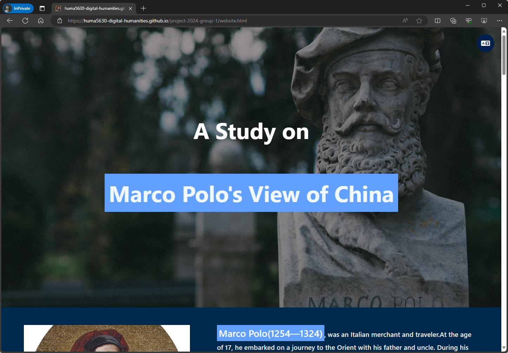
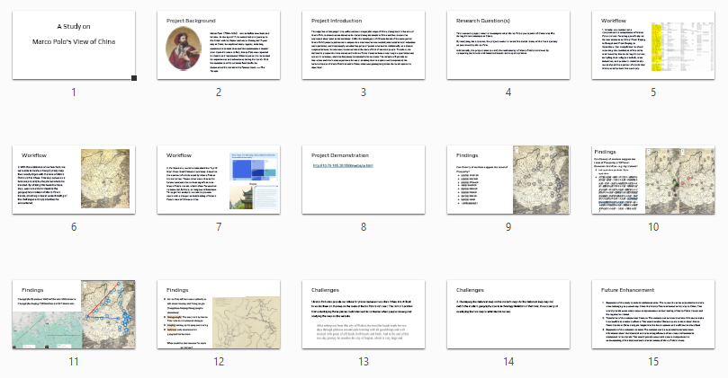

# Group Project for HUMA5630 Digital Humanities

| Student Name | UID | UST email | Github username |
| ------------ | --- | --------- | --------------- |
| Wong Ching Man   | 20690332 |  cmwongas@connect.ust.hk    |    [@boooom12376](https://github.com/boooom12376)       |
|  Wei Le          | 20994893 |  lweian@connect.ust.hk      |    [@Joey3345](https://github.com/Joey3345)          |

# Topic
A Study on Marco Polo's View of China

# URL
https://huma5630-digital-humanities.github.io/project-2024-group-1/website.html

# Presentation Slides
[PPT version](https://github.com/HUMA5630-Digital-Humanities/project-2024-group-1/blob/main/Final%20Project%20.pptx) | [PDF version](https://github.com/HUMA5630-Digital-Humanities/project-2024-group-1/blob/main/Final%20Project%20.pdf)

# Sharing
HKUST Library's Research Bridge: [Seeing China through Marco Polo’s Eyes](https://library.hkust.edu.hk/sc/china-marco-huma-5630/)
